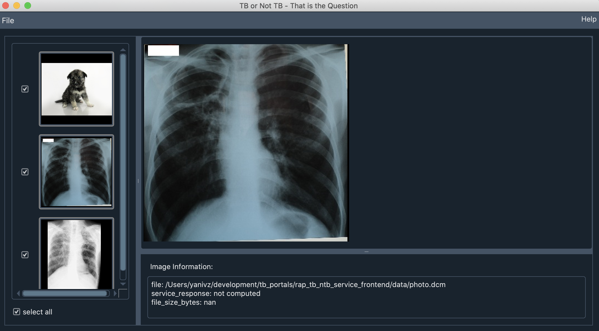

[](https://github.com/psf/black) &nbsp;&nbsp;

## Overview

This repository contains a PySide2/Qt5 based GUI for the [TB/not-TB service](https://rap.tbportals.niaid.nih.gov/#!/dashboard/image_analysis) from
the [NIAID TBPortals program](https://tbportals.niaid.nih.gov/).

The program allows you to load images and send them to the service. If the ground truth labels for the images are known it also allows you to evaluate the service's performance. For additional details see the program's help menu.



### Download
1. Dowload code as [zip file](https://github.com/niaid/rap_tb_ntb_service_frontend/archive/refs/heads/main.zip).
2. Clone repository using git (with GitHub account):

  ```
  git clone https://github.com/niaid/rap_tb_ntb_service_frontend.git
  ```

### Setup

1. Install a Python environment.
[[Miniconda download](https://docs.conda.io/en/latest/miniconda.html) or [plain Python download](https://www.python.org/downloads/)].
2. Configure and install the required Python packages.

  If using Miniconda/Anaconda:

  * **On Windows**: open the Anaconda Prompt (found under the Anaconda3 start menu).
  * **On Linux/OSX**: on the command line ```source path_to_your_anaconda3/bin/activate base```
```
  cd path_to_code_download_location
  conda env create -f environment.yml
  ```

  If using plain Python:

  Open the command line (a.k.a. command prompt, terminal):
```
cd path_to_code_download_location
python -m pip install --upgrade pip
pip install requirements.txt
```

### Development

Note that the three-image dataset available from this repository is stored using [git-lfs](https://git-lfs.github.com/) so you will need to install that if you want to obtain the images as part of the clone.

To install all of the components required by the program and additional ones used for development use the `environment_dev.yml` or `requirements_dev.txt` files.
